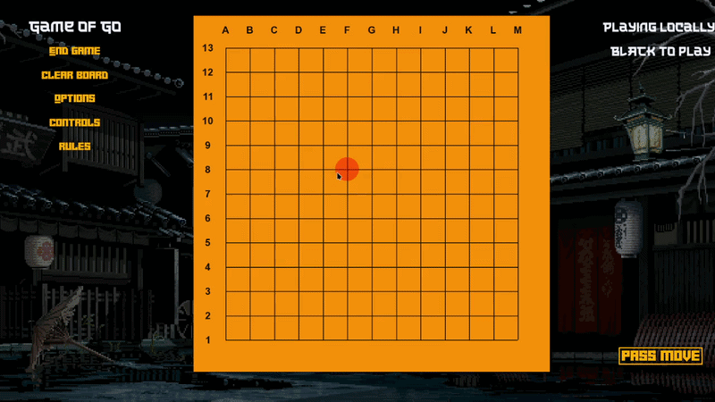

# Go Game
An implementation of the Game of Go, done in C++ using the SFML library. The application simulates the go rules and applies them to the board. The game can be played locally by two players. In the future, the application should support playing on a server and playing against an AI agent.



## Implementation details
The application is structured in the follwing sections: **frontend** and **backend**.

### Frontend
The frontend was done using the [SFML library](https://www.sfml-dev.org/), a very useful tool for creating GUI in C++.
The application makes use of some classes that deal with the visual aspect of the game: 

#### UI Design
The UI consists of *Label* and *Button* objects. Labels are understood as *drawable* elements and buttons are *labels* that are *clickable*.<br>
*IDrawable* and *IClickable* interfaces are interfaces for drawable elements and clickable elements, respectively.
  ```
  class IDrawable
  {
  public:
      IDrawable(sf::RenderWindow& window): window(window){}
      virtual void Render() = 0;
      virtual ~IDrawable() = default;
  };
  
  class IClickable
  {
  public:
      virtual void HandleClick(const std::optional<sf::Event> &event) = 0;
      virtual bool WasClicked() const = 0;
  };

  class Label: public IDrawable
  class Button: public Label, public IClickable
  ```
#### Visual Board Design
An importand part of the application is the frontend for the board. The board is created by overlapping two grids, as in GO, we place on intersections, not in cells. So, there is a grid of cells, and then lines of the board are drew over the grid. The *VisualBoard* object is also an *IDrawable*. The *VisualBoard* consists also of two *std::vectors* of *Pieces* and *Liberties*, where *Piece* is a template *Cell* object with *sf::CircleShape* as type and *Liberty* with *sf::RectangleShape* as type, like below:
```
template <typename DT>
class Cell : public IDrawable
{};
class Piece: public Cell<sf::CircleShape>
{};
class Liberty: public Cell<sf::RectangleShape>
{};

class VisualBoard: public IDrawable
{
private:
    BackendBoard backend_board;
    std::vector<std::vector<Piece>> piece_grid;
    std::vector<std::vector<Liberty>> liberty_grid;

public:
    void manageHovers(sf::Vector2i mouse_pos);
    void manageMouseClick(sf::Vector2i mouse_pos, CellType& turn);
};
```
#### Resource Manager
Resource managers are very useful when designing a frontend. The *Resource Manager* class manages the loading of fonts, textures and sounds.
```
class ResourceManager
{
private:
    std::map<std::string, std::shared_ptr<sf::Font>> fonts;
    std::map<std::string, std::shared_ptr<sf::Texture>> textures;
public:
    static ResourceManager& getInstance();
    std::shared_ptr<sf::Font> getFont(const std::string& path);
    std::shared_ptr<sf::Texture> getTexture(const std::string& path);
};
```
Also, for being consistent with a theme, I created a namespace with the colors for the application.
```
namespace Colors
{
    const sf::Color RED      = sf::Color(255, 0, 0, 255);
    const sf::Color BUTTON_COLOR = sf::Color(255, 174, 0);
    const sf::Color BOARD_BACKGROUND_COLOR = sf::Color(252, 144, 3);
    const sf::Color PIECE_HOVER_COLOR = sf::Color(255, 0, 0, 100);
    const sf::Color LIBERTY_COLOR = sf::Color(255, 234, 0);
}
```
#### Error Handling
Error handling is essential for both frontend and backend. There is an exception hierarchy built in. My application is susceptible to these types of errors in most part:
```
class GameException : public std::exception 
{
protected:
    std::string message;
public:
    explicit GameException(const std::string& msg);
    const char* what() const noexcept override;
};
class ResourceLoadException : public GameException
class InvalidMoveException : public GameException 
```
An exception may be thrown like this in *backend_board*:
```
if(hasFriendlyGroup && !friendlyGroupAlive && !hasEmptyNeighbour && enemy_capture_cnt == 0)
{
    //This move is suicide (do not allow)
    //revert changes
    for(auto grp:groups_of_covered_liberty)
        grp->addLiberty(curr_inter);
    throw InvalidMoveException("Suicide move!");
}
```
And caught like this in *visual_board*:
```
try
{
    backend_board.addStone(cx, cy, turn);        
}
catch (const InvalidMoveException& e)
{
    //invalid move
    std::cout<<e.what()<<"\n";
}
```


### Backend
The backend is the most intricate part of the implementation. I decided to go with the following when implementing the game logic: <br>
The *BackendBoard* is the heart of the application. The board is a matrix of *intersections*. Through the backend_board object we also maintain the group of stones as a std::set of *Groups*. 
-  An Intersection can be of a certain type (WHITE, BLACK or LIBERTY)
-  An Intersection points to multiple Groups it belongs to.
-  A Group can be of a certain type (WHITE or BLACK).
-  A Group consists of two sets of intersection. One set represent the stones of the group, and the other, it's liberties. 

```
class Group;
class Intersection
{
private:
    std::pair<int, int> coords;
    CellType type;
    std::set<Group*> groups;
};  

class Group
{
private:
    CellType group_type;
    std::set<Intersection*> stones;
    std::set<Intersection*> liberties;
public:
    Group();
    void extend(const Group* group);
};

class BackendBoard
{
private:
    std::vector<std::vector<Intersection>> board_matrix;
    std::set<Group*> white_groups;
    std::set<Group*> black_groups;
public:
    void addStone(int cx, int cy, CellType type);
};
```
When adding a stone or modifying the board's current configuration, the groups are adjusted dynamically. This is a tricky process split into multiple parts: adding a stone, managing group merges, managing captures, managing suicide situations and managing the [Ko rule](https://www.pandanet.co.jp/English/learning_go/learning_go_8.html). The Ko rule is implemented using [Zobrist Hashing](https://en.wikipedia.org/wiki/Zobrist_hashing) for efficient computation of past moves.

## Compilation instructions
The project is configured via [CMake](https://cmake.org/). <br>
Necessary libraries on linux:

Debian:
```sh
sudo apt-get update && \
  sudo apt-get install libxrandr-dev \
    libxcursor-dev \
    libudev-dev \
    libopenal-dev \
    libflac-dev \
    libvorbis-dev \
    libgl1-mesa-dev \
    libegl1-mesa-dev \
    libdrm-dev \
    libgbm-dev \
    libfreetype6-dev
```

Fedora:
```sh
sudo dnf install \
  libXrandr-devel \
  libXcursor-devel \
  systemd-devel \
  openal-soft-devel \
  flac-devel \
  libvorbis-devel \
  mesa-libGL-devel \
  mesa-libEGL-devel \
  libdrm-devel \
  mesa-libgbm-devel \
  freetype-devel
```

1. Configuration
```sh
cmake -S . -B build -DCMAKE_BUILD_TYPE=Debug
# or ./scripts/cmake.sh configure

# On Windows with GCC:
# cmake -S . -B build -DCMAKE_BUILD_TYPE=Debug -G Ninja
# sau ./scripts/cmake.sh configure -g Ninja
```

2. Compilation
```sh
cmake --build build --config Debug --parallel 6
# or ./scripts/cmake.sh build
```

3. Installation (optional)
```sh
cmake --install build --config Debug --prefix install_dir
# or ./scripts/cmake.sh install
```

## Future Improvements
Some features to be added to the application:
- Playing against a computer: KataGO agent.
- Playing on a server.
- Move History. Create an efficient system for keeping a history of moves.

## Resources

- [SFML](https://github.com/SFML/SFML/tree/2.6.1) (Zlib)
- [OpenAL](https://openal-soft.org/) (LGPL)
- [Robot-Crush Font](https://www.dafont.com/robot-crush.font)
- [Shuriken Font](https://www.dafont.com/the-last-shuriken.font)
- [Arial Font](https://font.download/font/arial)
